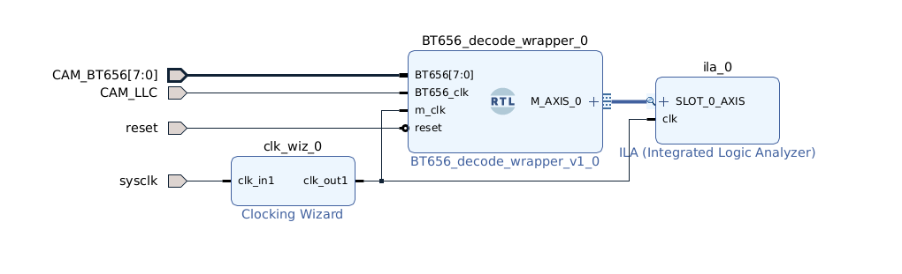
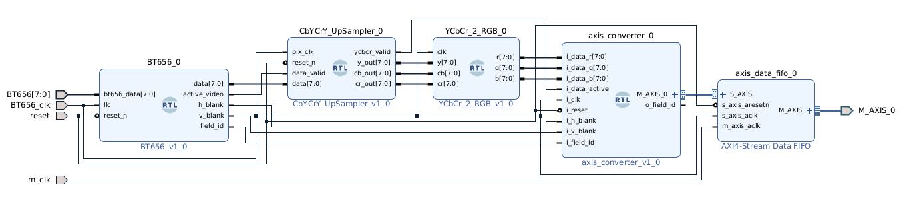
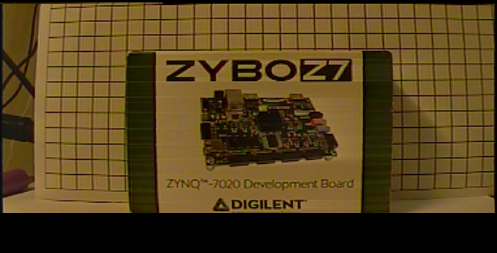

# BT656_2_AXI4S

## TODO
- Deinterlace by scanline interpolation
- Upscale for hdmi (minimum 25MHz pixel clock)

## Setup
In my testing i used an [FCB-EX1010](https://www.image-sensing-solutions.eu/fcb_ex1010_p.html) analog camera block as video source and connected it to [this analog video decoder board i designed](https://github.com/dylanmsu/ADV7180_to_Pmod) . As the FPGA i used the Digilent Zybo Z7-20 development board, but any board with three pmod ports in a row should also work.

## Working block diagram
### Top level

the clocking wizard is set to 11.36MHz instead of 13.5MHz (27MHZ/2) that is because we want only active pixels in the Internal logic analyzer (ILA). The video signal contains blanking periods which we do not want in our ILA  
bt656 clock = 27MHz  
blanking period = 272 clks  
active pixels/line = 720Y + 720C = 1440 clks  
27MHz * (1440/(1440+272))/2 = 11.36MHz  

### BT656 decoder

### Detailed overview
- **BT656_0** parses the [AV codes](https://techdocs.altium.com/display/FPGA/ITU-R+BT.656+Protocol) from the datastream comming from the BT656 video protocol. It outputs the h-blank, v-blank, active and field signals used by later blocks.

- **CbYCrY_UpSampler_0** converts the compressed 4:2:2 (YCb,YCr) encoding to a decompressed 4:4:4 (YCbCr,YCbCr) format.

- **YCbCr_2_RGB_0** converts the 4:4:4 YCbCr color space to 4:4:4 RGB

- **axis_converter_0** this block servers two purposes. It firstly generates the "end-of-line" and "start-of-frame" signals used by the AXI4-Stream protocol. The second purpose is to align all signals into an actual valid AXI4-Stream. 

- **axis_data_fifo_0** is a Xilinx IP used to buffer the outgoing video stream.

## result
After capturing the AXI4-Stream signals using an ILA in vivado, and decoding the signals using the included python script, this is the result. 

The image appears to have a low resolution in the y-axis because the camera block i used outputs interlaced video. There is also ghosting present, this may be caused by the non-ideal design of the interface board.

## Disclaimer
This is in no way a rigorously tested design and sould NOT be used in an actual implementation. This is a personal project to learn more about VHDL and video processing. I got it to work on my specific setup and i cannot guarantee that it will work on other hardware.
